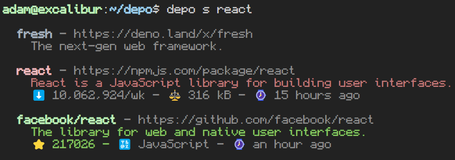

# 🚚 Depo


### This is a very new project and a work in progress - not yet recommended for use.

Depo is a simple package manager for [Deno](https://deno.land/), mostly wrapping the [esm.sh](https://esm.sh/) package cache. _Not affiliated with Deno or esm.sh_

# Installation

I still need to figure out how ```deno install <remote script>``` works, so for now you can install Depo via:
```bash
git clone https://github.com/kahnpoint/depo
cd depo
deno task build
``` 

# Usage

`depo init my-app -y` to initalize a new project

Depo will manage creating and caching the deps.ts file for you, so it is recommended to import dependencies using their import maps and let Deno handle the tree-shaking.

## Commands

- ```init [name]```
  - Initialize repo with Depo.
- ```install, i [source] <modules...>```
  - Install module(s) from a source.
  - Defaults to npm (via esm.sh), but will install deno std modules from deno.land.
  - Currently supported sources are 
    - deno, d 
    - npm, n 
    - github, gh
- ```update, u <modules...>```
  - Upgrade Modules
- ```remove, r <modules...>``` 
  - Remove (uninstall) module(s)
- ```cache, c```
  - Generate and cache deps.ts
  - This is used if you manually add a module to deno.json
- ```search, s [source] <library> [count]```
  - Search Deno.land, NPM, or Github.
    

# Roadmap
This is my first project using Deno, so I am planning on adding more features as I use it more.

Todo list:
- Tests
- CI/CD
- Reduce the number of init confirmation questions
- Use Deno.openKv() to store user settings
- Automod: a feature to automatically generate a mod.ts file for each folder
- Docs: set up a docs folder for static site generation with
  [Lume](https://lume.land/)
